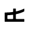
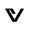

# Carida <!-- omit in toc -->

Carida is a font based on the [Aurebesh](https://starwars.fandom.com/wiki/Aurebesh) writing system used in various Star Wars media. The font includes all 34 letters, standard and alternative digits, and 15 punctuation symbols. Points and corners are slightly rounded, and most glyph pairs are kerned.

- [Overview](#overview)
- [Download \& Install](#download--install)
- [Copyright Notice](#copyright-notice)
- [Details](#details)
  - [Letters](#letters)
  - [Digits](#digits)
  - [Punctuation](#punctuation)
  - [Alternate Digits](#alternate-digits)

## Overview

Glyphs are constructed on a grid of 32 columns and 20 rows with the ascender and descender adding 4 and 2 rows, respectively. The letter Shen has a wider glyph due to its leading diacritic symbol.

## Download & Install

You can download the latest version by clicking this link: [Download Carida](https://github.com/brokenarc/bantha-fonts/releases/latest/download/carida.zip)

The download contains the font in `.otf` format for use on Windows, macOS, and Linux. Consult your operating system's documentation for guidance on how to install fonts.

Web font versions in `.woff` and `.woff2` are also provided. You can learn how to use web fonts on [Mozilla's web fonts page](https://developer.mozilla.org/en-US/docs/Learn/CSS/Styling_text/Web_fonts).

## Copyright Notice

Star Wars, Aurebesh, and the Aurebesh glyph designs are the exclusive property of LucasFilm Ltd.

This project is a fair use fan work intended for use by cosplayers, LARPers, and TTRPG players. The font binaries and graphic source files are offered under [The Unlicense](https://unlicense.org), and it is the user's responsibility to ensure that their usage of them respects LucasFilm Ltd.'s intellectual property rights.

## Details

### Letters

The core letter set is mapped to the lowercase Latin characters `a`-`z`. The digraph phonemes are mapped to the uppercase Latin characters (`A`, `C`, `E`, `K`, `N`, `O`, `S`, and `T`).

| Glyph                                 | Name        | Key Mapping | Unicode Mapping |
| ------------------------------------- | ----------- | ----------- | --------------- |
|   | Aurek (a)   | `a`         | `U+0061`        |
|    | Besh (b)    | `b`         | `U+0062`        |
|   | Cresh (c)   | `c`         | `U+0063`        |
|    | Dorn (d)    | `d`         | `U+0064`        |
|     | Esk (e)     | `e`         | `U+0065`        |
|    | Forn (f)    | `f`         | `U+0066`        |
|    | Grek (g)    | `g`         | `U+0067`        |
|    | Herf (h)    | `h`         | `U+0068`        |
|     | Isk (i)     | `i`         | `U+0069`        |
|   | Jenth (j)   | `j`         | `U+006A`        |
|   | Krill (k)   | `k`         | `U+006B`        |
|    | Leth (l)    | `l`         | `U+006C`        |
|    | Mern (m)    | `m`         | `U+006D`        |
|    | Nern (n)    | `n`         | `U+006E`        |
|     | Osk (o)     | `o`         | `U+006F`        |
|    | Peth (p)    | `p`         | `U+0070`        |
|     | Qek (q)     | `q`         | `U+0071`        |
|    | Resh (r)    | `r`         | `U+0072`        |
|   | Senth (s)   | `s`         | `U+0073`        |
|   | Trill (t)   | `t`         | `U+0074`        |
|     | Usk (u)     | `u`         | `U+0075`        |
|     | Vev (v)     | `v`         | `U+0076`        |
|    | Wesk (w)    | `w`         | `U+0077`        |
|    | Xesh (x)    | `x`         | `U+0078`        |
|    | Yirt (y)    | `y`         | `U+0079`        |
|   | Zerek (z)   | `z`         | `U+007A`        |
|  | Cherek (ch) | `C`         | `U+0043`        |
|    | Enth (ae)   | `A`         | `U+0041`        |
|   | Onith (eo)  | `E`         | `U+0045`        |
|  | Krenth (kh) | `K`         | `U+004B`        |
|     | Nen (ng)    | `N`         | `U+004E`        |
|  | Orenth (oo) | `O`         | `U+004F`        |
|    | Shen (sh)   | `S`         | `U+0053`        |
|   | Thesh (th)  | `T`         | `U+0054`        |

### Digits

The standard digits are mapped to the Arabic numerals `0`-`9`.

| Glyph                            | Name  | Key Mapping | Unicode Mapping |
| -------------------------------- | ----- | ----------- | --------------- |
|  | Zero  | `0`         | `U+0030`        |
|  | One   | `1`         | `U+0031`        |
|  | Two   | `2`         | `U+0032`        |
|  | Three | `3`         | `U+0033`        |
|  | Four  | `4`         | `U+0034`        |
|  | Five  | `5`         | `U+0035`        |
|  | Six   | `6`         | `U+0036`        |
|  | Seven | `7`         | `U+0037`        |
|  | Eight | `8`         | `U+0038`        |
|  | Nine  | `9`         | `U+0039`        |

### Punctuation

| Glyph                                             | Name               | Key Mappings  | Unicode Mappings             |
| ------------------------------------------------- | ------------------ | ------------- | ---------------------------- |
|               | Comma              | `,`           | `U+002C`                     |
|  | Full Stop (period) | `.`           | `U+002E`                     |
|       | Question Mark      | `?`           | `U+003F`                     |
|    | Exclamation Mark   | `!`           | `U+0021`                     |
|               | Colon              | `:`           | `U+003A`                     |
|           | Semicolon          | `;`           | `U+003B`                     |
|        | Hyphen-minus       | `-`           | `U+002D`                     |
|   | Left Double Quote  | `“`, `«`      | `U+201C`, `U+00AB`           |
|  | Right Double Quote | `"`, `”`, `»` | `U+0022`, `U+201D`, `U+00BB` |
|   | Left Single Quote  | `‘`, `‹`      | `U+2018`, `U+2039`           |
|  | Right Single Quote | `'`, `’`, `›` | `U+0027`, `U+2019`, `U+203A` |
|    | Left Parenthesis   | `(`           | `U+0028`                     |
|   | Right Parenthesis  | `)`           | `U+0029`                     |
|     | Slash (solidus)    | `/`           | `U+002F`                     |
|             | Credits            | `$`, `€`, `£` | `U+0024`, `U+20AC`, `U+00A3` |

### Alternate Digits

The [alternate numerical system](https://starwars.fandom.com/wiki/Aurebesh#Alternate_numerical_system) is present in some recent media. These digits are mapped to the circled number dingbats and are not directly accessible on the keyboard. They may be accessed via a character map tool or by using the Unicode value with the proper escape sequence for your application.

| Glyph                            | Name  | Unicode Mapping |
| -------------------------------- | ----- | --------------- |
|  | Zero  | `U+24EA`        |
|  | One   | `U+2460`        |
|  | Two   | `U+2461`        |
|  | Three | `U+2462`        |
|  | Four  | `U+2463`        |
|  | Five  | `U+2464`        |
|  | Six   | `U+2465`        |
|  | Seven | `U+2466`        |
|  | Eight | `U+2467`        |
|  | Nine  | `U+2468`        |
